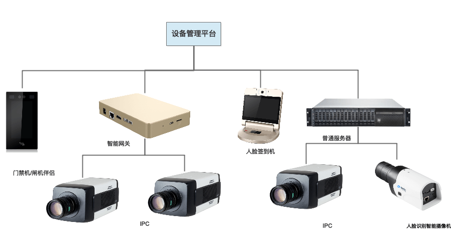
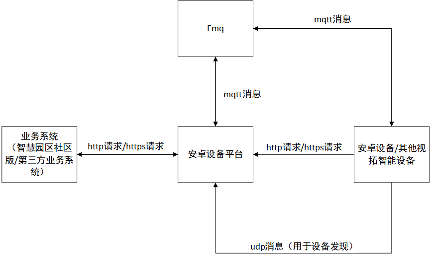
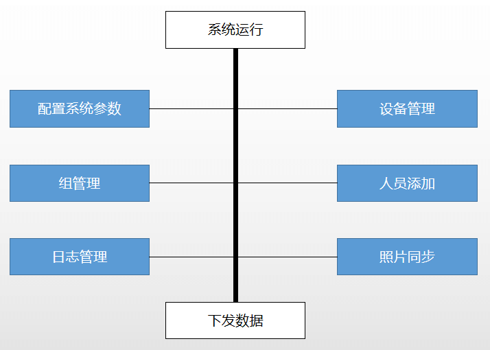
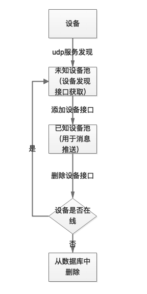

## 1、系统说明

中科视拓设备管理平台是在中科视拓智能设备（门禁机/闸机伴侣，智能网关，人脸签到机）的基础上，运用高可用性和高扩展性的IoT技术进行深度二次开发、封装的一个稳定、高效、免费的HTTP服务，协助用户快速的集成、接入中科视拓智能设备，使得客户可以集中精力专注自己的业务系统研发。




### 1.1 系统简介

#### 1.1.1 系统运行说明

* 系统依赖于Emq、MongoDB运行
* 系统根据环境变量(seeta_device_mode)选择配置文件，支持debug,release,test
* 系统使用可信地址列表(resource/config/auth.yaml)来控制请求，列表支持热更新


#### 1.1.2 上游业务系统（智慧园区社区版或第三方业务系统）简介
1) 创建系统参数，设备和人员信息
2) 设备管理平台在收到添加信息之后，验证信息并存储到数据库中，随后使用mqtt协议推送给相应的设备信息更新消息。 

#### 1.1.3 智能终端软件简介
* 平台进行udp服务监听，监听智能终端的服务发现
* 智能终端状态变更，发送mqtt消息，平台监听topic，如果存在状态回调地址，则进行状态变更回调
* 智能终端在收到emq推送消息后，更新该智能终端自身数据
* 智能终端运行状态、日志上报

## 2. 功能说明
### 2.1 系统架构



* 安卓设备与平台之间通过udp组播的方式进行服务发现，两者通过http协议和mqtt协议进行通信
* 安卓设备和平台的mqtt通信通过emq中间件来进行转发
* 业务系统与平台之间通过http协议进行通信

### 2.2 系统功能视图


图 2.2-1 设备管理功能视图

图中蓝色框部分功能是设置相关的业务接口。系统调用流程如下：

* 调用系统参数设置接口配置系统参数
* 硬件接入内网后，设备会UDP服务接入设备管理平台。
* 依次调用设备发现、增加接口方可管理设备。
* 若要管理多个设备，使用“组”功能，调用组的创建、删除、设置设备默认参数统一管理设置
* 调用设备设置接口和流参数相关接口（增加、编辑、删除）接口，配置硬件系统参数属性
* 调用人员信息接口（添加人员、添加人员照片、删除人员、删除人员照片、编辑人员等）管理人员信息

### 2.3 设备状态变更说明



* 设备进行服务发现后，设备从未连接状态变为未知设备
* 调用设备添加接口后，设备从未知设备变为已知设备
* 调用设备删除接口后，如果设备在线，则设备变为未知设备,此时可重新进行服务发现，否则判定该设备已不存在，进行删除设备

### 2.4 回调机制

1. 业务系统在平台设备参数中设置回调的url
2. 当平台判断设备需进行回调时（如设备状态改变，输出错误日志等），平台调用设置的url告知业务系统且把数据存储到数据库中
3. 业务系统可以通过各种查询接口（如日志查询，设备查询，照片注册查询等）进行查询详细的内容

### 2.5 人脸检测说明

平台可通过SeetaCloud（SeetaCloud为人脸识别服务，分为云端服务和本地服务，该服务可对上传的照片进行人脸识别）进行人脸检测，即系统参数中设置seetacloud_url，若不设置，则跳过人脸检测，直接添加照片。

seetacloud_url分为如下两类：
1. 服务器本地部署的SeetaCloud，如："http(s)://ip:port/seetacloud/cpp/detect"
2. 开放云的人脸识别服务，如："http(s)://&lt;api_key&gt;:&lt;secret_key&gt;@cloud.seetatech.com/api/face/detect"


## 3. 系统部署

系统运行需要EMQ和MongoDB的支持。请提前安装服务。
 **部署SeetaDevice**
resource文件夹说明：

```
  resource
    └── config
        ├── auth.yaml
        ├── config_debug.yaml
        └── config_release.yaml
```

  auth.yaml：业务系统ip白名单，只允许名单内的业务系统访问，支持文件热更新
  config_debug.yaml,config_release.yaml程序配置文件包含:

    * mongodb连接配置
    * mqtt连接配置
    * udp组播接收和返回key值
    * 日志和数据文件路径

  

具体见下文


```
    path:
      log_path: "logs/" #日志路径
      device_file_path: "data/device_file/" #设备相关文件路径
      person_file_path: "data/person_file/" #人员相关文件路径
    handshake_key: "ping" #用于UDP服务组播，与安卓程序保持一致
    response_key: "PONG" #用于UDP服务组播, 与安卓程序保持一致
    begin_key: "" #用于UDP服务组播, linux,docker中请设置为“”,Windows: 值和handshake_key不同
    db:
      mongo: #MongoDB
        url: "mongodb://127.0.0.1:27017" #MongoDB连接url
        db_name: "db_seeta_device" #MongoDB使用的数据库名
    mqtt:
      user: "admin" # emq用户名称
      password: "public" # emq用户密码
      protocol: "tcp" #mqtt protocol
      ip: "192.168.0.136" #emq的服务地址,
      tcp_port: "1883" #mqtt tcp端口
      server_port: "18083" #emq 客户端端口
      status_topic: "device_status" #设备状态上报topic，需与安卓保持一致，不能修改
      log_topic: "device_log" #设备日志上报topic，需与安卓保持一致，不能修改
      version_topic: "device_version" #设备版本上报topic，需与安卓保持一致，不能修改
   
```

 1 物理部署（根据系统选用linux或者Windows的二进制文件） 


   ```
   运行程序之前需修改resource文件夹内配置文件和权限文件，二进制文件与resource文件夹需在同级目录运行
 
   命令说明：
   版本显示：<binary_file> version
   http服务：<binary_file> server -m <mode> -p <port>
   udp组播服务：<binary_file> multicast -m <mode> -p <port> -a <addr>
   定时脚本：<binary_file> timing -m <mode>
   
   参数说明：
   <binary_file>:运行的二进制文件
   <mode>:运行的模式，支持debug,release，没有此参数默认为debug，根据不同的模式选用不同的配置文件
   <port>:监听端口，udp组播端口必须与http服务端口相同，如果不同则组播服务必须指定-a参数
   <addr>:udp组播返回安卓的地址，如果两者端口或ip不同，则必须指定该地址，如:127.0.0.1:7878
   ```

2 docker部署 

> 1 拉取镜像

```
  docker pull seetaresearch/seeta_device:v0.4.8
```
> 2 运行镜像

```
docker run -d --name <container_name> --restart=always --net=host -v <resource_path>:/code/resource -v <data_path>:/code/data -v <logs_path>:/code/logs seetaresearch/seeta_device:v0.4.8 <command>
```

参数说明：

```
  <container_name>:容器名称
  <resource_path>:资源文件夹路径，外部resource文件夹路径，如未挂载，则使用内部resource文件夹，想要修改则进入运行容器内部修改，见下文描述
  <data_path>:数据文件夹，程序运行过程中保存文件使用
  <logs_path>:日志文件夹，程序运行中输出的日志
  <command>:如果未指定命令，效果如同 ./seeta_device server -m release，如果想指定命令，具体见物理部署命令说明 
```

> 3 修改资源文件说明：

```
执行命令进入容器内：
 docker exec -it <container_name> /bin/sh
修改配置文件
   vi resource/config/config_release.yaml
   vi resource/config/config_debug.yaml
修改权限文件
   vi resource/config/auth.yaml
退出容器
   exit
重启容器
 docker restart <container_name>
```

## 4. 系统接口文档

* 请求方必须在受信任地址列表中
* POST请求类型与接口返回类型都为application/json数据格式
* 已知设备：添加之后的设备，未知设备：设备发现接口中发现的设备
* 设备参数分为系统自带默认参数，系统设置默认参数，设备设置参数。层级依次增加，后者如果设置则覆盖前者
* 组别如果实现为树形结构，平台只会保存叶子组别名称，层级结构需业务系统自己实现
* 日志等级为int类型，1:DEBUG,2:INFO,3:WARN,4:ERROR,数字越大越严重
* 设备类型定义: 1：人证一体机，2：门禁机，3：智能网关，4：pc智能网关
* 设备摄像头参数默认id:"default"，若不传摄像头id，则默认为"default"

> http请求头部展示

```
POST /seetadevice/v1/platform/group/create HTTP/1.1
Host: 127.0.0.1:7878
Content-Type: application/json
cache-control: no-cache
Postman-Token: de2ccdbf-306a-4bec-977d-1bf1fa76eb51

```
## LINK

* [中科视拓设备管理平台接口文档](./api.md)


