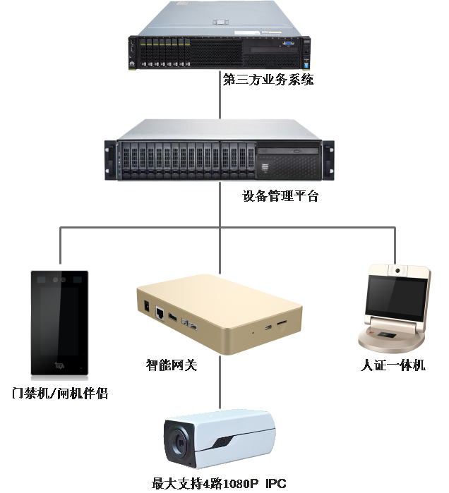
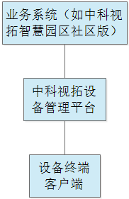
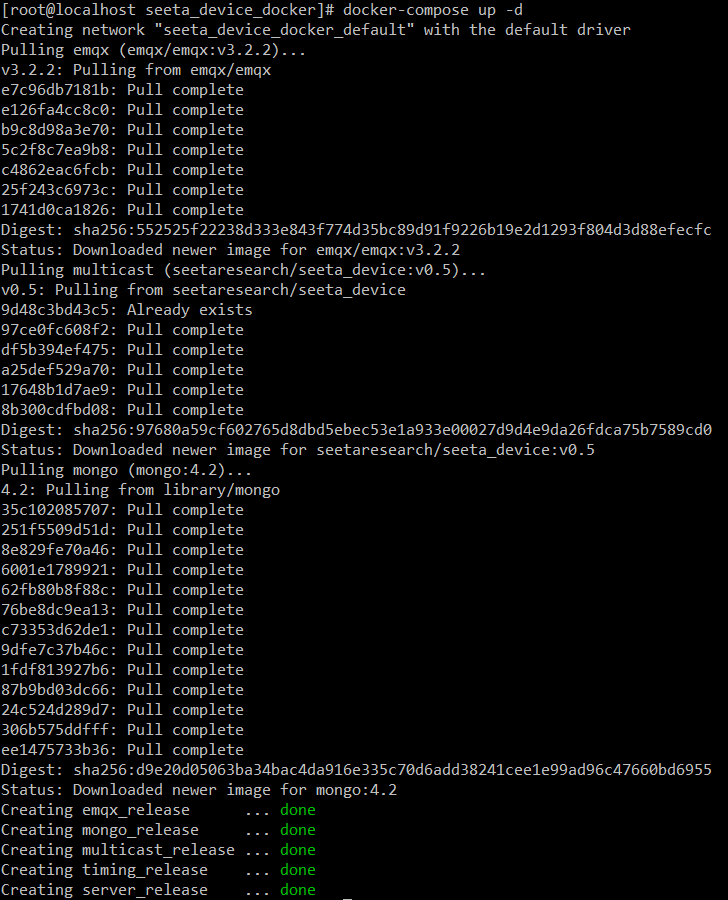
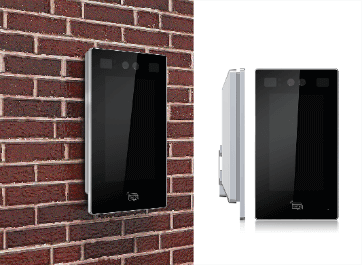
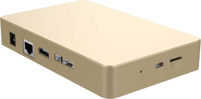
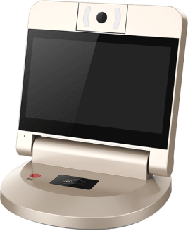

## 1、系统说明

中科视拓设备管理平台是在中科视拓智能设备（门禁机/闸机伴侣，智能网关，人脸签到机）的基础上，运用高可用性和高扩展性的IoT技术进行深度二次开发、封装的一个稳定、高效、免费的HTTP服务，协助用户快速的集成、接入中科视拓智能设备，使得客户可以集中精力专注自己的业务系统研发。


### 1.1 系统简介

中科视拓设备管理平台是中科视拓贯彻“开源赋能共发展”的合作理念，把自身在智慧园区人脸门禁领域中的多年丰富经验，免费与合作伙伴共享，无license限制，可直接用于各商业项目中。共享的组件有：

- 中科视拓智慧园区社区版[Web后端（GO）源码](https://github.com/SeetaFaceEnv/SeetaFaceApps)、[Web前端（VUE）源码](https://github.com/SeetaFaceEnv/SeetaFaceAppsWeb)。中科视拓智慧园区社区版已含人脸门禁领域中的核心功能：人员管理、设备管理、通行时间管理和通行记录管理等。
- 中科视拓设备管理平台[SeetaDevice服务](https://github.com/SeetaFaceEnv/SeetaDevice)。中科视拓设备管理平台是中科视拓智能设备（门禁机/闸机伴侣，智能网关，人证一体机）的IoT服务平台，以HTTP接口方式对外提供二次开发，协助用户快速的集成、接入中科视拓智能设备，使得客户可以集中精力专注自己的业务系统研发。

### 1.2 用户价值

通过中科视拓设备管理平台，合作伙伴可以零基础也能迅速进入智慧园区人脸门禁领域；在项目前期，甚至可以零研发投入下，满足甲方需求。具体的：利用中科视拓智慧园区社区版Web后端、前端源码，迅速形成自己的业务系统；利用中科视拓设备管理平台服务，迅速搭建自己的人脸门禁机IoT平台服务。

### 1.3 典型的硬件组网



- 第三方业务系统。合作伙伴可以充分利用中科视拓智慧园区社区版Web后端、前端源码，甚至在不改一行代码的情况下，只需加上自己的logo，更换项目名称，便可搭建起自己的业务系统。
- 设备管理平台：支持物理和docker部署，支持公、私网部署。

### 1.4 软件组件图



### 1.5 中科视拓设备管理平台特性

#### 1.5.1 IoT平台

物联网（Internet of thing, IoT）需要解决的核心几个问题是设备管理，指令下发，数据获取等。中科视拓设备管理平台运用业内主流、成熟的IoT技术，满足高可用性和高扩展性。

### 1.5.2 底库人员灵活性
- 通行时间灵活：设备可以设置其通行时间。在通行时间内，设备才工作。如节假日，对于大门门禁，可以设置其不工作。大大增加安全性。
- 人员有效期灵活：在一些场景下，人员有有效期，如访客，有拜访的有效期；如学生，有在校期间的有效期等。
- 人员通用性：不同业务场景，对于人员属性截然不同，如对于学生有学号，对于企业有职位等等。中科视拓设备管理平台对于人员属性透明，很好的满足其通用性。
### 1.5.3 设备管理便捷性
- 设备组管理设备：设备组很好的管理具有相同行为和相同底库的设备。设备管理平台的请求支持以组为单位，这样设备管理平台无需挨个操作设备。
- 设备二次鉴权：对于设备识别通过的请求，业务系统可以决定是否需要识别记录以及是否需要二次鉴权。而这，只需要设置回调地址即可。
- 设备远程控制：设备管理平台能够给某个设备发送指令，如给特点设备发送开门指令，测试闪光点和音频等。
- 设备远程更新：通过设备管理平台，可以远程更新设备apk。

## 2. 功能说明
### 2.1 系统架构


* 安卓设备与平台之间通过udp组播的方式进行服务发现，两者通过http协议和mqtt协议进行通信
* 安卓设备和平台的mqtt通信通过emq中间件来进行转发
* 业务系统与平台之间通过http协议进行通信

### 2.2 系统功能视图


图 2.2-1 设备管理功能视图

图中蓝色框部分功能是设置相关的业务接口。系统调用流程如下：

* 调用系统参数设置接口配置系统参数
* 硬件接入内网后，设备会UDP服务接入设备管理平台。
* 依次调用设备发现、增加接口方可管理设备。
* 若要管理多个设备，使用“组”功能，调用组的创建、删除、设置设备默认参数统一管理设置
* 调用设备设置接口和流参数相关接口（增加、编辑、删除）接口，配置硬件系统参数属性
* 调用人员信息接口（添加人员、添加人员照片、删除人员、删除人员照片、编辑人员等）管理人员信息

### 2.3 设备状态变更说明


* 设备进行服务发现后，设备从未连接状态变为未知设备
* 调用设备添加接口后，设备从未知设备变为已知设备
* 调用设备删除接口后，如果设备在线，则设备变为未知设备,此时可重新进行服务发现，否则判定该设备已不存在，进行删除设备

### 2.4 回调机制

1. 业务系统在平台设备参数中设置回调的url
2. 当平台判断设备需进行回调时（如设备状态改变，输出错误日志等），平台调用设置的url告知业务系统且把数据存储到数据库中
3. 业务系统可以通过各种查询接口（如日志查询，设备查询，照片注册查询等）进行查询详细的内容

### 2.5 人脸检测说明

平台可通过SeetaCloud（SeetaCloud为人脸识别服务，分为[云端服务](https://cloud.seetatech.com/#/home)和本地服务，该服务可对上传的照片进行人脸识别）进行人脸检测，即系统参数中设置seetacloud_url，若不设置，则跳过人脸检测，直接添加照片。

seetacloud_url分为如下两类：
1. 服务器本地部署的SeetaCloud，如："http(s)://ip:port/seetacloud/cpp/detect"
2. 开放云的人脸识别服务，如："http(s)://&lt;api_key&gt;:&lt;secret_key&gt;@cloud.seetatech.com/api/face/detect"


## 3. 系统部署

如为物理部署，系统运行需要EMQ和MongoDB的支持。请提前安装服务。
 **部署SeetaDevice**
resource文件夹说明：

```
  resource
    └── config
        ├── auth.yaml
        └── config_release.yaml
```

  auth.yaml：业务系统ip白名单，只允许名单内的业务系统访问，支持文件热更新，支持关键字all(如all: true),\*(如192.168.0.\*: true)
  
  config_release.yaml程序配置文件包含:

    * mongodb连接配置
    * mqtt连接配置
    * udp组播接收和返回key值
    * 日志和数据文件路径

具体见下文


```yaml
    path:
      log_path: "logs/" #日志路径
      device_file_path: "data/device_file/" #设备相关文件路径
      person_file_path: "data/person_file/" #人员相关文件路径
    handshake_key: "ping" #用于UDP服务组播，与安卓程序保持一致
    response_key: "PONG" #用于UDP服务组播, 与安卓程序保持一致
    task_timeout: 16 #同步等待时间
    timing_report: false #定时上报所有设备状态
    db:
      mongo: #MongoDB
        url: "mongodb://127.0.0.1:27017" #MongoDB连接url
        db_name: "db_seeta_device" #MongoDB使用的数据库名
    mqtt:
      user: "admin" # emq用户名称
      password: "public" # emq用户密码
      protocol: "tcp" #mqtt protocol
      ip: "192.168.0.136" #emq的服务地址,
      tcp_port: "1883" #mqtt tcp端口
      server_port: "18083" #emq 客户端端口
      status_topic: "device_status" #设备状态上报topic，需与安卓保持一致，不能修改
      log_topic: "device_log" #设备日志上报topic，需与安卓保持一致，不能修改
      version_topic: "device_version" #设备版本上报topic，需与安卓保持一致，不能修改
   
```

1、 docker-compose部署 

1 部署docker
```bash
#安装
sudo yum install -y yum-utils device-mapper-persistent-data lvm2
sudo yum-config-manager --add-repo http://mirrors.aliyun.com/docker-ce/linux/centos/docker-ce.repo
sudo yum makecache fast

yum list docker-ce --showduplicates | sort -r #查看可用版本
sudo yum install docker-ce-<VERSION STRING> # 安装19.03版本

#启动
sudo systemctl start docker
sudo systemctl enable docker
```

2 部署docker-compose
```bash
sudo curl -L "https://github.com/docker/compose/releases/download/1.24.1/docker-compose-$(uname -s)-$(uname -m)" -o /usr/local/bin/docker-compose
sudo chmod +x /usr/local/bin/docker-compose
sudo ln -s /usr/local/bin/docker-compose /usr/bin/docker-compose
```

3 修改.env文件内路径和端口

```dotenv
mode=release #运行模式
server_image=seetaresearch/seeta_device:v0.7.beta #使用镜像

mongo_port=27018 #mongodb端口，覆盖配置文件设置
mongo_db_path=./db
mongo_user=root #mongodb用户名，覆盖配置文件设置
mongo_password=makenosense #mongodb密码，覆盖配置文件设置

emq_tcp=1883 #emq的tcp映射端口
emq_ws=8083 #emq的ws映射端口
emq_dashboard=18083 #emq的dashboard映射端口

resource_path=./resource
logs_path=./logs
data_path=./data
```

4 修改配置文件(resource/config/config_release.yaml)

```yaml
handshake_key: "ping" #must same as Android's handshake_key
response_key: "PONG" #must same as Android's response_key
task_timeout: 16 #同步等待时间
timing_report: false #定时上报设备状态
db:
  mongo:
    addr: "127.0.0.1:27017" #mongo连接地址，需和.env文件内的mongo端口一致
mqtt:
  ip: "192.168.0.136" #修改为emq所在的服务器地址
```

5 鉴权文件(resource/config/auth.yaml)添加业务系统ip地址
```yaml
ips:
  127.0.0.1: true
```

6 运行程序 `docker-compose up -d` 运行结果如下：



2、 物理部署（根据系统选用linux或者Windows的二进制文件） 

1 修改配置文件(resource/config/config_release.yaml)

配置文件具体信息见系统部署配置文件说明

2 运行程序

   ```
   运行程序之前需修改resource文件夹内配置文件和权限文件。
   二进制文件与resource文件夹需在同级目录运行。
   程序依赖于mongodb,emq运行，需提前安装mongodb和emq。
 
   命令说明：
   版本显示：<binary_file> version
   http服务：<binary_file> server -m <mode> -p <port>
   udp组播服务：<binary_file> multicast -m <mode> -p <port> -a <addr>
   定时脚本：<binary_file> timing -m <mode>
   
   参数说明：
   <binary_file>:运行的二进制文件
   <mode>:运行的模式，支持debug,release，没有此参数默认为debug，根据不同的模式选用不同的配置文件
   <port>:监听端口，udp组播端口必须与http服务端口相同，如果不同则组播服务必须指定-a参数
   <addr>:udp组播返回安卓的地址，如果两者端口或ip不同，则必须指定该地址，如:127.0.0.1:7878
   ```

## 4. 系统接口文档

* 请求方必须在受信任地址列表中
* POST请求类型与接口返回类型都为application/json数据格式
* 已知设备：添加之后的设备，未知设备：设备发现接口中发现的设备
* 设备参数分为系统自带默认参数，系统设置默认参数，设备设置参数。层级依次增加，后者如果设置则覆盖前者
* 组别如果实现为树形结构，平台只会保存叶子组别名称，层级结构需业务系统自己实现
* 日志等级为int类型，1:DEBUG,2:INFO,3:WARN,4:ERROR,数字越大越严重
* 设备类型定义: 1：人证一体机，2：门禁机，3：智能网关，4：pc智能网关
* 设备摄像头参数默认id:"default"，若不传摄像头id，则默认为"default"

> http请求头部展示

```
POST /seetadevice/v1/platform/group/create HTTP/1.1
Host: 127.0.0.1:7878
Content-Type: application/json
cache-control: no-cache
Postman-Token: de2ccdbf-306a-4bec-977d-1bf1fa76eb51

```
## LINK

* [中科视拓设备管理平台接口文档](./api.md)

# 5. 视拓智能终端设备

## 5.1 门禁机/闸机伴侣

|硬件说明|产品图|
|---|---|
|型号：K-Y3 <br>CPU：瑞芯微3288<br>摄像头：双目（一目可见光，一目红网光）<br>屏幕：7英寸触摸屏/非触摸屏<br>客户端模式：强<br>存储：8GB<br>内存：2GB<br>外观尺寸：138MM * 245MM * 37MM<br>控制方式：<br>•	开关量输出<br>•	RS485<br>•	门磁检测<br>• 消防联动<br>产品执行标准：<br>• GA/T 394-2002 出入口控制系统技术要求<br>• GA/T 1260-2016 人行出入口电控通道闸通用技术要求<br>• GA/T 18239-2000 集成电路(IC)卡读写机通用规范||

## 5.2 智能网关

|硬件说明|产品图|
|---|---|
|型号：906N-T3<br>CPU：双核Cortex-A72+四核Cortex-A53，大小核CPU结构，主频最高1.8GHz<br>客户端模式：强<br>存储：16GB<br>内存：2GB+1GB（2GB for CPU, 1GB for NPU）<br>外观尺寸：100MM * 160MM * 30MM<br>支持路数：<br>• 1080P RTSP流：4路<br>控制方式：<br>• 开关量输出<br>• RS485||

## 5.3 人证一体机

|硬件说明|产品图|
|---|---|
|型号：905K-Y1<br>CPU：瑞芯微3288<br>摄像头：单目<br>屏幕：10.1英寸彩色液晶显示屏<br>客户端模式：强<br>存储：8GB<br>内存：2GB<br>外观尺寸：26CM * 23CM * 29CM<br>产品执行标准：<br>• GA/T 1903-2013 出入口控制人脸识别系统技术要求||